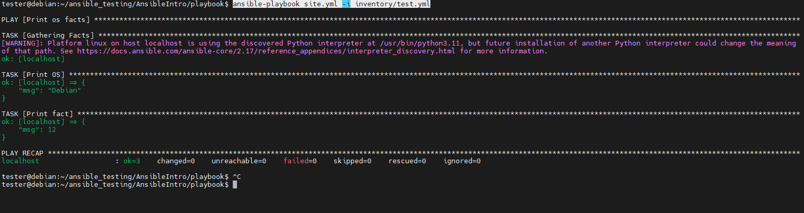
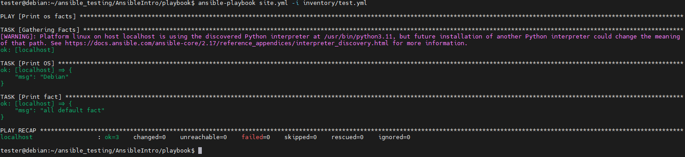
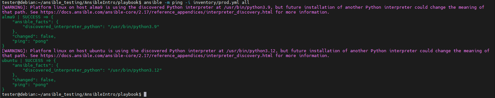
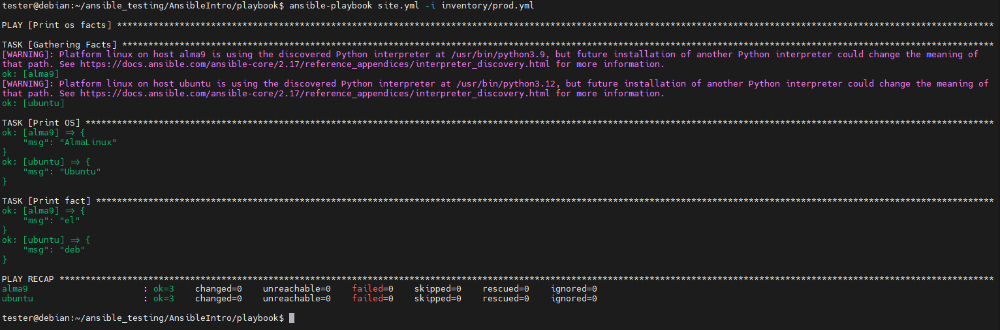
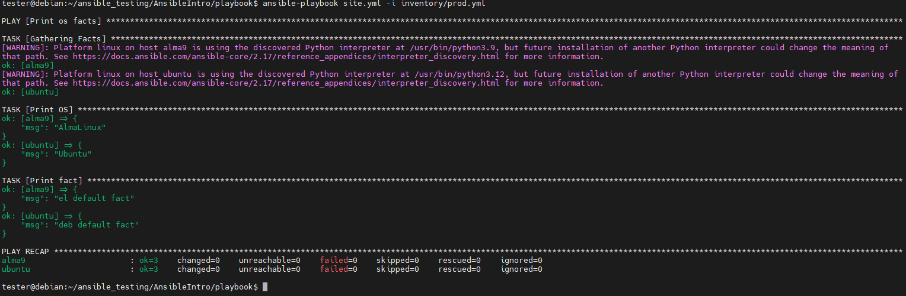
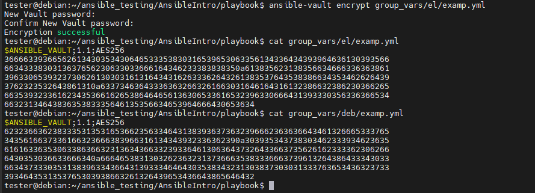
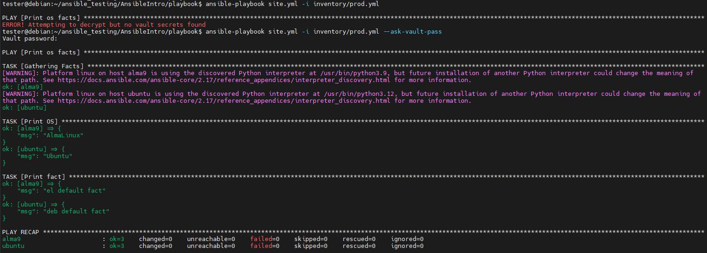
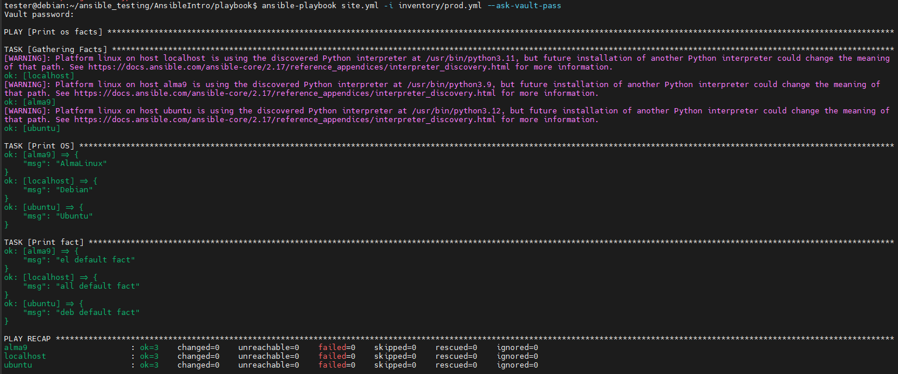

# Домашнее задание к занятию 1 «Введение в Ansible»

https://github.com/netology-code/mnt-homeworks/tree/MNT-video/08-ansible-01-base

## Подготовка к выполнению

1. Установите Ansible версии 2.10 или выше.
2. Создайте свой публичный репозиторий на GitHub с произвольным именем.
3. Скачайте [Playbook](./playbook/) из репозитория с домашним заданием и перенесите его в свой репозиторий.

## Основная часть

1. Попробуйте запустить playbook на окружении из `test.yml`, зафиксируйте значение, которое имеет факт `some_fact` для указанного хоста при выполнении playbook.
2. Найдите файл с переменными (group_vars), в котором задаётся найденное в первом пункте значение, и поменяйте его на `all default fact`.
3. Воспользуйтесь подготовленным (используется `docker`) или создайте собственное окружение для проведения дальнейших испытаний.
4. Проведите запуск playbook на окружении из `prod.yml`. Зафиксируйте полученные значения `some_fact` для каждого из `managed host`.
5. Добавьте факты в `group_vars` каждой из групп хостов так, чтобы для `some_fact` получились значения: для `deb` — `deb default fact`, для `el` — `el default fact`.
6.  Повторите запуск playbook на окружении `prod.yml`. Убедитесь, что выдаются корректные значения для всех хостов.
7. При помощи `ansible-vault` зашифруйте факты в `group_vars/deb` и `group_vars/el` с паролем `netology`.
8. Запустите playbook на окружении `prod.yml`. При запуске `ansible` должен запросить у вас пароль. Убедитесь в работоспособности.
9. Посмотрите при помощи `ansible-doc` список плагинов для подключения. Выберите подходящий для работы на `control node`.
10. В `prod.yml` добавьте новую группу хостов с именем  `local`, в ней разместите localhost с необходимым типом подключения.
11. Запустите playbook на окружении `prod.yml`. При запуске `ansible` должен запросить у вас пароль. Убедитесь, что факты `some_fact` для каждого из хостов определены из верных `group_vars`.
12. Заполните `README.md` ответами на вопросы. Сделайте `git push` в ветку `master`. В ответе отправьте ссылку на ваш открытый репозиторий с изменённым `playbook` и заполненным `README.md`.
13. Предоставьте скриншоты результатов запуска команд.

## Необязательная часть

1. При помощи `ansible-vault` расшифруйте все зашифрованные файлы с переменными.
2. Зашифруйте отдельное значение `PaSSw0rd` для переменной `some_fact` паролем `netology`. Добавьте полученное значение в `group_vars/all/exmp.yml`.
3. Запустите `playbook`, убедитесь, что для нужных хостов применился новый `fact`.
4. Добавьте новую группу хостов `fedora`, самостоятельно придумайте для неё переменную. В качестве образа можно использовать [этот вариант](https://hub.docker.com/r/pycontribs/fedora).
5. Напишите скрипт на bash: автоматизируйте поднятие необходимых контейнеров, запуск ansible-playbook и остановку контейнеров.
6. Все изменения должны быть зафиксированы и отправлены в ваш личный репозиторий.


## Решение основной части

1. `ansible-playbook site.yml -i inventory/test.yml`


2. Меняем файл `group_vars/all/examp.yml`


3. Готовим окружение
    ```
    docker run -dit --name ubuntu ubuntu:latest
    docker run -dit --name alma9 almalinux:9 # or rockylinux

    ansible -m ping -i inventory/prod.yml all

    docker exec -it ubuntu /bin/sh
    apt update && apt install python3
    exit

    ansible -m ping -i inventory/prod.yml all
    ```
    

4. `ansible-playbook site.yml -i inventory/prod.yml`


5. Поменяли group_vars
6. Проверяем `ansible-playbook site.yml -i inventory/prod.yml`
    

7. Шифруем
    ```
    ansible-vault encrypt group_vars/deb/examp.yml
    ansible-vault encrypt group_vars/el/examp.yml
    ```
    

8. `ansible-playbook site.yml -i inventory/prod.yml --ask-vault-pass`
    

9. Для просмотра списка плагинов можно использовать `ansible-doc -l`. Для моей control-node подойдёт плагин local

10. Поменяли inventory/prod.yml, добавив туда localhost
11. `ansible-playbook site.yml -i inventory/prod.yml --ask-vault-pass`
    